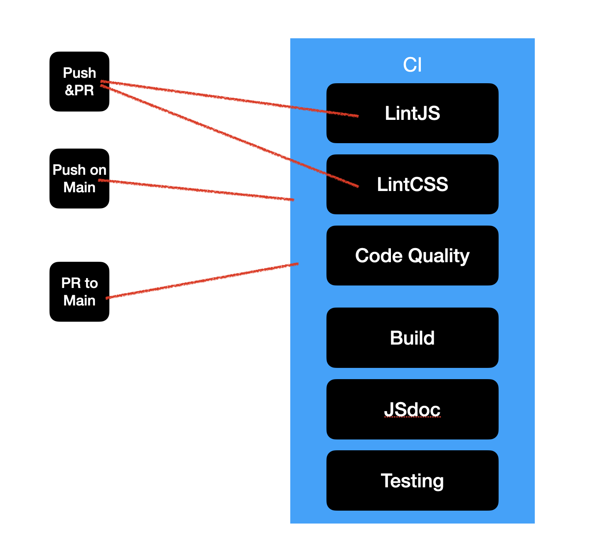

# CI/CD for mixMatch

**Below is the diagram for the pipeline**

## What is currently functional

- [x] Linting
    - LintJS
        - Using ESLint to lint the JavaScript code
            - It will trigger when a pull request is made on **all branches** and push to **all branches**
            - We will comply with the Google style guide
    - LintCSS
        - Using Stylelint to lint the CSS code
        - It will trigger when a pull request is made on **all branches** and push to **all branches**
- [x] Code Quality
    - using GitHub build in for code quality and security check
    - It will trigger when a pull request is made on **main branch** and push to **main branch**
- [x] Build
    - Build the project using npm command, which will run the test and build the project
    - Ensure the new codes and functions will not break the current project
        - It will trigger when a pull request is made on **main branch** and push to **main branch**
- [x] Test
    - Run the test using npm command
        - This is use to testing all the APIs and functions and testing app functionality.
        - It can help us to ensure the new codes and functions will not break the current project, and also ensure the
          new functions are working as expected. It is designed to be run on the main branch. And it will indicate which
          API or function is not working as expected. So we can fix it before merging the new codes to the main branch.
    - It will trigger when a pull request is made on **main branch** and push to **main branch**
- [x] JSdoc
    - Generate the documentation using jsdoc
        - This is use to generate the documentation for the project
        - The documentation will be generate from the comments in the code, provide the information about the function
          and the parameters, and the return value. For some function, it will also provide the example of how to use
          the function and the expected output. This can help the developer to understand the function and how to use.
        - A github page will be created to host the documentation
    - It will trigger when a pull request is made on **main branch** and push to **main branch**

