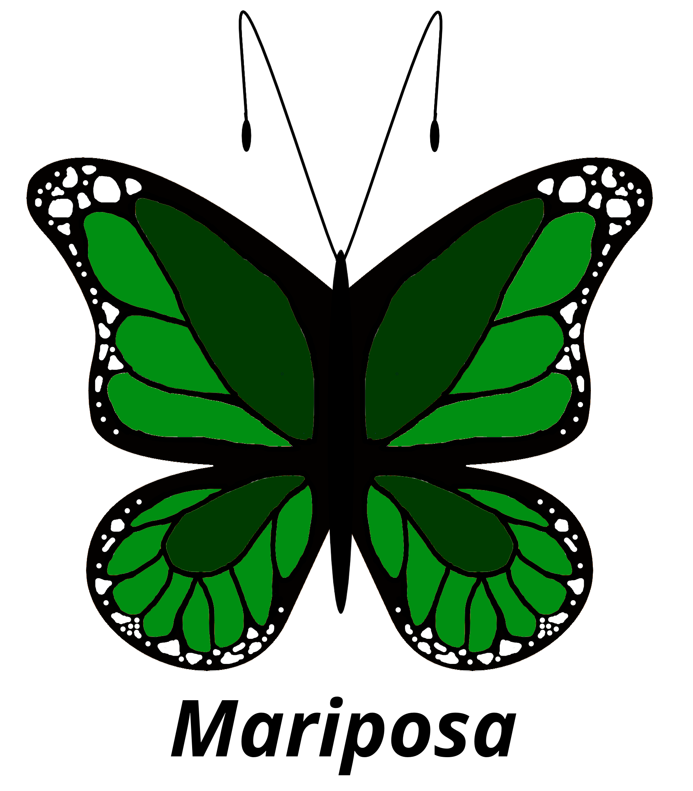

# Team Mariposa
 

## Team Values
We aim to promote a positive work environment, where opinions are respected and humility is appreciated. We aim to work together as equals towards a common goal. We aim to help each other in our time of need. We aim to encourage collaboration amongst all members to fuse our ideas into one great creation. We strive to become better programmers every day and improve ourselves and our product. We aim to perform to the best of our ability, striving for a product that goes beyond the bare minimum. We aim to value our clients as our own and give them the best experience.
 
| Roster | About | GitHub |
| ------ | ----- | ------ |
| Brian Dinh        | Hello, I’m Brian Dinh. I’m a third year CS major from Warren. I enjoy programming, playing video games, watching anime and going on walks/hikes. I also am planning to continue writing this year when I have time. I am interested in Machine Learning and its potentially useful applications while still acknowledging the potentially negative applications. | [view](https://github.com/TheFProjects)   |
| Liam Golly        | Hello, I’m Liam Golly, a third year CE major from Revelle. I am mostly interested in working with embedded systems, although I also enjoy dabbling in higher level software, and I like reading, programming, and playing video games in my free time. | [view](https://github.com/liamgolly)      |
| Xuying He         | Hi, I am Xuying He. This is my second year at UCSD, and my major is Math-CS. I like playing mobile games in my spare time. I'm excited to be teaming up with everyone and doing some fun web development together this quarter.| [view](https://github.com/pika-chu11)     |
| Jeremy Lei        | Hi, I am Jeremy, a third year Math-CS student. I’ve been really big into wushu (basically kung fu) this past year. I also enjoy rock climbing, cycling, and playing video games. | [view](https://github.com/countpearsauce) |
| Andrew Man        | Hello World, this is Andrew from Team Mariposa. I am a current Computer Science major with interests in Math and Economics as well so the application of all 3 domains would be something like trading algos. Though this class is focused on web development I am still excited to polish my skills   | [view](https://github.com/AndrwMan) |  
| Alvin Mangaliman  | Greetings! I’m Alvin and I'm majoring in Computer Science. I’m interested in computer graphics and augmented reality. My hobbies include running, bowling, and all things music! | [view](https://github.com/realhumanbeen)  |
| Yinlong Mi        | (about) | [view](https://github.com/YinlongMi)      |
| Noah Terminello   | Hi everyone! My name is Noah. I'm a Math-CS major. In my free time, I like to inline skate and play video games. A fun fact about me: I have over 100 hours of experience riding trains. I'm excited to do some web development with everyone. | [view](https://github.com/owadg)          |
| Jiseung Yoo       | (about) | [view](https://github.com/wltmd153)       |
| Chi Zang          | Hi, I am Chi Zhang from Warren College from Team Mariposa, currently majoring in computer science under the CSE department. This is the third year for me at UCSD. I have computer graphics, frontend, UI, and data science. I love watching anime and making music in my free time. | [view](https://github.com/chizhang9135)   |
